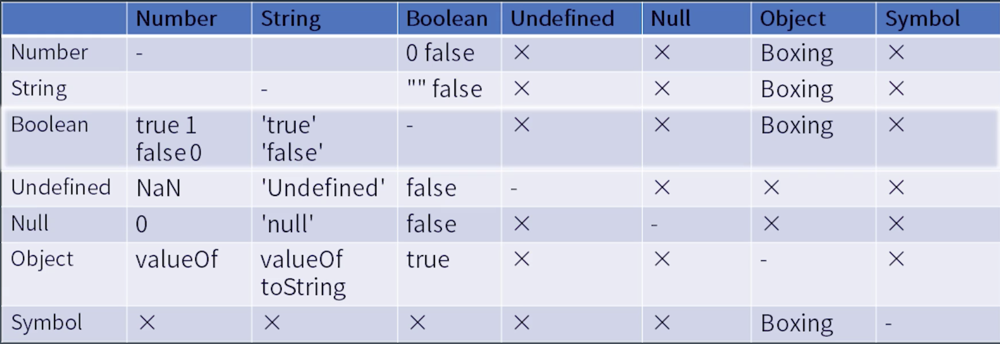
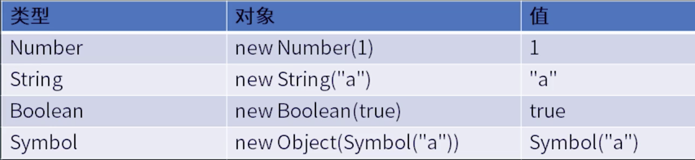

# JavaScript 表达式

从小到大, 优先级从高到低：

Atom, Expression, Statement, Structure, Program/Module

## Atom

表达式的最小单位，它所涉及的语法结构也是优先级最高的。其中包括：

* 基本类型的直接量
    ```javascript
    "abc";
    123;
    null;
    true;
    false;
    ```
* 对象类型
    
    在语法层面，function、{ 和 class 开头的表达式语句与声明语句有语法冲突，所以，我们要想使用这样的表达式，必须加上括号来回避语法冲突。
    ```javascript
    ({});
    (function(){});
    (class{ });
    [];
    /abc/g;
    ```
* this & 变量
    
    在语法上，把变量称作“标识符引用”。

任何表达式加上圆括号，都被认为是 Primary Expression，这个机制使得圆括号成为改变运算优先顺序的手段。

## 表达式

优先级： Member Expression > New Expression > Call Expression > Expression

### Member Expression

为了属性访问而设计的。

```javascript
a.b; // 用标识符的属性访问
a["b"]; // 用字符串的属性访问
foo`I am ${name}. Hello`; // foo(["I am ", ". Hello", name])
new.target; // 用于判断函数是否是被 new 调用
super.b; // 用于访问父类的属性
```

> Member Expression `a.b`, 在运行时中 (runtime), 返回的是**引用（refence）**， 不是值。

### New Expression

Member Expression 加上 new 就是 New Expression。

例子：
* `new a()()`: 先执行`new a()`, 后执行第二个`()`
* `new new a()`: 先执行`new a()`， 后执行第一个`new`

### Call Expression

```javascript
foo();
super();
foo()['b'];
foo().b;
foo()`abc`;
```

例子：
* `new a()['b']`: 先`new a()`, 后访问属性`['b']`

### Left hand Expression

能放到等号左边的表达式。

例子：
```javascript
a.b = c
```

反例（**Update Expression**不能放在等号左边）
```javascript
-- a;
++ a;
a --
a ++
```

### 一元运算表达式 UnaryExpression
```javascript
// removes a property from an object
delete a.b;
// The void operator evaluates the given expression and then returns undefined.
void a; 
typeof a;
- a;
~ a; // 按位取反
! a;
await a;
```

## Expression

乘初， 加减， 位移， 关系判断（大于，小于），相等（===， !==），位运算，逻辑判断(&&, ||)，条件判断(condition? case1 : case2)

## 类型转换



## 拆箱（unboxing）

Object转换成基本类型。`toPremitive`函数参与了这个过程。有3个函数影响`toPremitive`：

* valueof()
* toString()
* Symbol.toPremitive: 定义了这个，则忽略上面两个

```javascript
var o1 = {
    valueof() { return 1 },
    toString() { return "2" }
}

var o2 = {
    valueof() { return 1 },
    toString() { return "2" },
    [Symbol.toPremitive]() { return 3; }
}

x[o1] === x["2"]; // true, toString
x[o2] === x["3"]; // true, toPremitive

console.log("x" + o1) // x1, valueof
console.log("x" + o2) // x3, toPremitive
```

## 装箱（Boxing）

