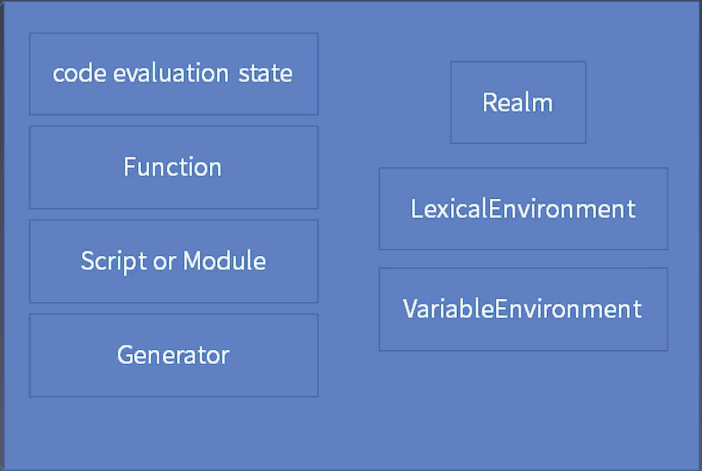

# JavaScript 表达式

从小到大, 优先级从高到低：

Atom, Expression, Statement, Structure, Program/Module

## Atom

表达式的最小单位，它所涉及的语法结构也是优先级最高的。其中包括：

* 基本类型的直接量
    ```javascript
    "abc";
    123;
    null;
    true;
    false;
    ```
* 对象类型
    
    在语法层面，function、{ 和 class 开头的表达式语句与声明语句有语法冲突，所以，我们要想使用这样的表达式，必须加上括号来回避语法冲突。
    ```javascript
    ({});
    (function(){});
    (class{ });
    [];
    /abc/g;
    ```
* this & 变量
    
    在语法上，把变量称作“标识符引用”。

任何表达式加上圆括号，都被认为是 Primary Expression，这个机制使得圆括号成为改变运算优先顺序的手段。

## 表达式

优先级： Member Expression > New Expression > Call Expression > Expression

### Member Expression

为了属性访问而设计的。

```javascript
a.b; // 用标识符的属性访问
a["b"]; // 用字符串的属性访问
foo`I am ${name}. Hello`; // foo(["I am ", ". Hello", name])
new.target; // 用于判断函数是否是被 new 调用
super.b; // 用于访问父类的属性
```

> Member Expression `a.b`, 在运行时中 (runtime), 返回的是**引用（refence）**， 不是值。

### New Expression

Member Expression 加上 new 就是 New Expression。

例子：
* `new a()()`: 先执行`new a()`, 后执行第二个`()`
* `new new a()`: 先执行`new a()`， 后执行第一个`new`

### Call Expression

```javascript
foo();
super();
foo()['b'];
foo().b;
foo()`abc`;
```

例子：
* `new a()['b']`: 先`new a()`, 后访问属性`['b']`

### Left hand Expression

能放到等号左边的表达式。

例子：
```javascript
a.b = c
```

反例（**Update Expression**不能放在等号左边）
```javascript
-- a;
++ a;
a --
a ++
```

### 一元运算表达式 UnaryExpression
```javascript
// removes a property from an object
delete a.b;
// The void operator evaluates the given expression and then returns undefined.
void a; 
typeof a;
- a;
~ a; // 按位取反
! a;
await a;
```

## Expression

乘初， 加减， 位移， 关系判断（大于，小于），相等（===， !==），位运算，逻辑判断(&&, ||)，条件判断(condition? case1 : case2)

### 类型转换


### 拆箱（unboxing）

Object转换成基本类型。`toPremitive`函数参与了这个过程。有3个函数影响`toPremitive`：

* valueof()
* toString()
* Symbol.toPremitive: 定义了这个，则忽略上面两个

```javascript
var o1 = {
    valueof() { return 1 },
    toString() { return "2" }
}

var o2 = {
    valueof() { return 1 },
    toString() { return "2" },
    [Symbol.toPremitive]() { return 3; }
}

x[o1] === x["2"]; // true, toString
x[o2] === x["3"]; // true, toPremitive

console.log("x" + o1) // x1, valueof
console.log("x" + o2) // x3, toPremitive
```

### 装箱（Boxing）


## Statement语句

### Completion Record

语句通过 Completion Record, 实现语句的控制

* `[[type]]`: normal, break, continue, return, throw
* `[[value]]`: 基本类型
* `[[target]]`: label (ie, out: for(...), `out`就是label)

### 简单语句

Expression, Empty (;), Debugger (debugger;), Throw, Continue, Break, Return

### 复合语句

Block, If, Switch, Iteration (for, while, ...), With, Labelled, Try

### 声明（Declaration）

* `function, function *, async function, async function *`: 函数声明
* `var`
* `class`
* `let, const`

#### 预处理(pre-process)

所有的声明都有预处理。

对于`var， function`, 在预处理中，会**变量提升**，提到第一句来执行。`class, let, const`则不会。

```javascript
// var
console.log(a); // undefined
var a = 3;
// 预处理为
var a;
console.log(a); // undefined
var a = 3;

//  函数
helloWorld();  // 打印 'Hello World!'
function helloWorld(){
  console.log('Hello World!');
}

// var + 函数
helloWorld();  // TypeError: helloWorld is not a function
var helloWorld = function(){
  console.log('Hello World!');
}
// 预处理为
var helloWorld;
helloWorld();  // TypeError: helloWorld is not a function
var helloWorld = function(){
  console.log('Hello World!');
}

// let, const
// 报错
console.log(b); // ReferenceError
const b = 3;

// class
// 报错
let peter = new Person('Peter', 25); // ReferenceError
class Person {
  constructor(name, age) {
    this.name = name;
    this.age = age;
  }
}
```
#### 作用域

* var的作用域：它所在的函数体
* let，const的作用域：它所在的区块`{}`

## 宏观和微观任务

采纳 JSC 引擎的术语，我们把**宿主发起的任务**称为宏观任务，把 **JavaScript引擎**发起的任务称为微观任务。

在宏观任务中，JavaScript 的 **Promise 还会产生异步代码（微任务）**，JavaScript 必须保证这些异步代码在一个宏观任务中完成。

## 事件循环

get codes -> execute -> wait -> get codes

## 函数调用

使用**栈**，保存各个函数，已备调用。

* 栈：Execution Context Stack
* 栈内元素：Execution Context
* 栈顶元素：Running Execution Context


### Execution Context



### LexicalEnvironment (词法环境)

* this
* new.target
* super
* variable

> 只有`var`的声明会被存到VariableEnvironment

**Environment Record**

链式结构，从上到下：
* Environment Record (ER)
* ER -> Declarative ER, Global ER, Object ER
* Declarative ER -> Function ER, Module ER

### Closure (闭包)

闭包 = 环境(Environment Record) + 代码

JS的每个函数，都会生成闭包. 例子：
```javascript
const y = 2;
function foo2() {
  console.log(y);
}
foo2();
```
对于`foo2`:
* Environment Record: y:2
* 代码: console.log(y)

常见的闭包：
```javascript
const y = 2;
function foo2() {
  console.log('out');
  const z = 3;
  return function() {
    console.log('in');
    console.log(y, z);
  }
}
foo2()();
```

* 执行`foo2()`时，会形成一个内部闭包，产生`z = 3`。
* 执行`foo2()()`时，先读取当前环境（y：2），再生成闭包的内部环境（z:3），最后执行闭包（`console.log(y,z)`）。


### Realm

在一个js引擎中，所有内置对象会放进一个Realm中。


