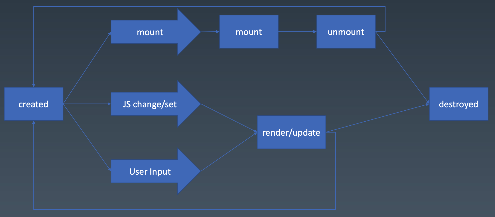

# 组件

* properties
* methods
* inherit
* attribute
* config & state
* event
* lifecyle
* children

## attribute vs property

* attribute:

    概念源于html，强调**描述性**

    ```html
    <my-component attr="a">
    ```

    ```javascript
     myComponent.getAttribute('attr');
     myComponent.setAttribute('attr', 'a');
    ```

* property

    概念源于面向对象，强调**从属性**

    ```javascript
    myComponent.attr = a;
    ```

实例：

1. attribute -> class， 而property -> class, or property -> className

    ```html
    <div class="cls"></div>
    <script>
        var div = document.getElementByTagName('div');
        div.className //cls
    </script>
    ```

    注意，React中用`className`会自动在HTML的元素中加上class

2. attribute可以是string, property 可以是Object

    ```html
    <div style="color:blue;"></div>
    <script>
        var div = document.getElementByTagName('div');
        div.style //type of Object
    </script>
    ```

3. property可以是revolve过的结果

    ```html
    <a href="//m.taobao.com"></a>
    <script>
        var a = document.getElementByTagName('a');
        a.href; // "https://m.taobao.com"
        a.getAttribute('href'); // "//m.taobao.com"
    </script>
    ```

4. input的value

    ```html
    <input value="cute" />
    <script>
        var input = document.getElementByTagName('input');
        input.value; // cute
        input.getAttribute('value'); // cute

        input.value = 'hello';
        input.value; // hello
        input.getAttribute('value'); // cute
        // input.value = 'hello'; 只改变了property，没改变attribute
        // 元素实际效果以property优先
    </script>
    ```

## attribute vs property vs state vs config


> Markup set: hmtl set, 例如 `<div class="cls"></div>`

* attribute，property可以被用户改变，但一般不会这么做。通常都是JS改变它们。

* state只能被用户改变。

* config只能被JS设置，且在组件初始化设置后，不再被改变

## lifecycle



1. 组件始于create, 终于destroy

2. 组件会被挂载到屏幕（mount），也会被取下（unmount），且会不断重复

3. 组件会被**用户**或者**JS**改变（update）

## Children

分为两类：

* Template：会改变DOM结构的Children， 比如一个list，会根据data生成`<li>`

* Content: 不会改变DOM结构的Children
