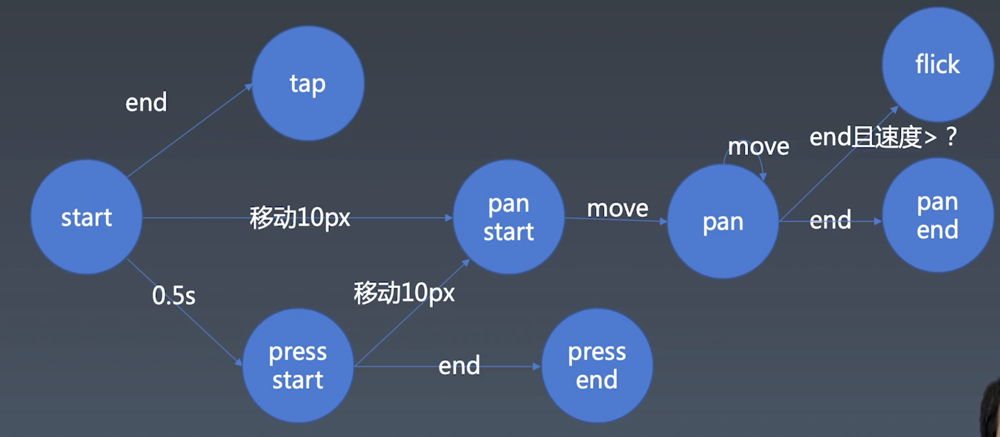

# 手势

## 基本状态



重点：

1. **三种动作**：tap, pan, press， 初始**状态**为 `tap start`。 **状态变化**时要**更新动作**。

2. 进入 press 的条件：tap 超过 0.5s

    实现: 
    * `tap start`: `pressHandler = setTimeout(() =>{ // press start }, 500)`
    
    * `tap end`, `pan start`: `clearTimeout(pressHandle)` 
    
    * `press start`: `pressHandler = null`

3. flick

    判断：松开前**0.5s**内的**速度 (v)**，如果 **v > 1.5ms**, 就进入 flick 状态


## 鼠标和触控

* **鼠标拖拽**

    在 `mousedown` (拖拽开始) 的监听事件中，监听 `mousemove` (拖拽执行), `mouseup` (拖拽终止)

    ```javascript
    el_1.addEventListener('mousedown', event => {
        const move = event => {
            // main action
            console.log(event.clientX, event.clientY);
        }

        const up = event => {
            // remove listeners
            el_2.removeEventListener('mousemove', move);
            el_2.removeEventListener('mouseup', up);
        }

        el_2.addEventListener('mousemove', move);
        el_2.addEventListener('mouseup', up);
    })
    ```

    通常，`el_1` 是拖拽对象所对应的 HTML 元素， `el_2`是全局: `document`. 这是为了保证拖拽不被意外中断

* **触摸拖拽**

    分别监听四类事件：

    * touchstart
    * touchmove
    * touchend
    * touchcancel: 异常终止

    事件有 `changedTouches` 属性，返回`TouchList` (支持多点触控)。

    `TouchList`中的每个 touch 有 identifier，用来跟踪一个点的拖动

这两种操作监听所得的事件，都能获得坐标（clientX, clientY)，因此，这**两种拖动事件**能用**一种逻辑**进行编写。

```
const down = point => {
    console.log('down', point.clientX, point.clientY);
}

const move = point => {
    console.log('move', point.clientX, point.clientY);
}

const up = point => {
    console.log('up', point.clientX, point.clientY);
}

const cancel = point => {
    console.log('cancel', point.clientX, point.clientY);
}
```

### bug: 

在chrome的移动端模式，单次点击鼠标（按下松开，且不拖动），会同时触发 touch 和 mouse 事件。

## context

上述4种函数都作用于**全局状态**，如果想确定作用域，可以传入 context

```javascript
const up = (point, context) => {}
```

在处理**触控（touch）** 事件:

* 使用 `Object.create(null)` 来创建 context

    `Object.create(null)` 使 proptotype 为 null，更干净

* 使用 `Map` 保存所有**触点**的 context

    * key: touch.identifier
    * value: context

在处理**鼠标（mouse）** 事件:

* "mousedown”, "mouseup" event 中， 有 button 属性。 它代表哪个鼠标按键被按下

    0：左键，1: 中键，2: 右键

* “mousemove” event, 没有 button，但有 buttons，同样表示哪个鼠标按键被按下

    0b00001: 左键， 0b00010: 右键，0b00100: 中键

    0b00011: 左右两键同时被按下

**注意右键**： event.button = 2; event.buttons = 0b00010

所以，在存 context 时， 使用二进制的掩码作为 key，比较合适

```javascript
let context = Object.create(null);
const button = 1 << event.button;

contexts.set('mouse' + button, context);
```

## 派发事件

```javascript
function dispatch(type, props) {
    let event = new Event(type);
    for (let name in props) {
        event[name] = props[name];
    }
    element.dispatchEvent(event);
}
```